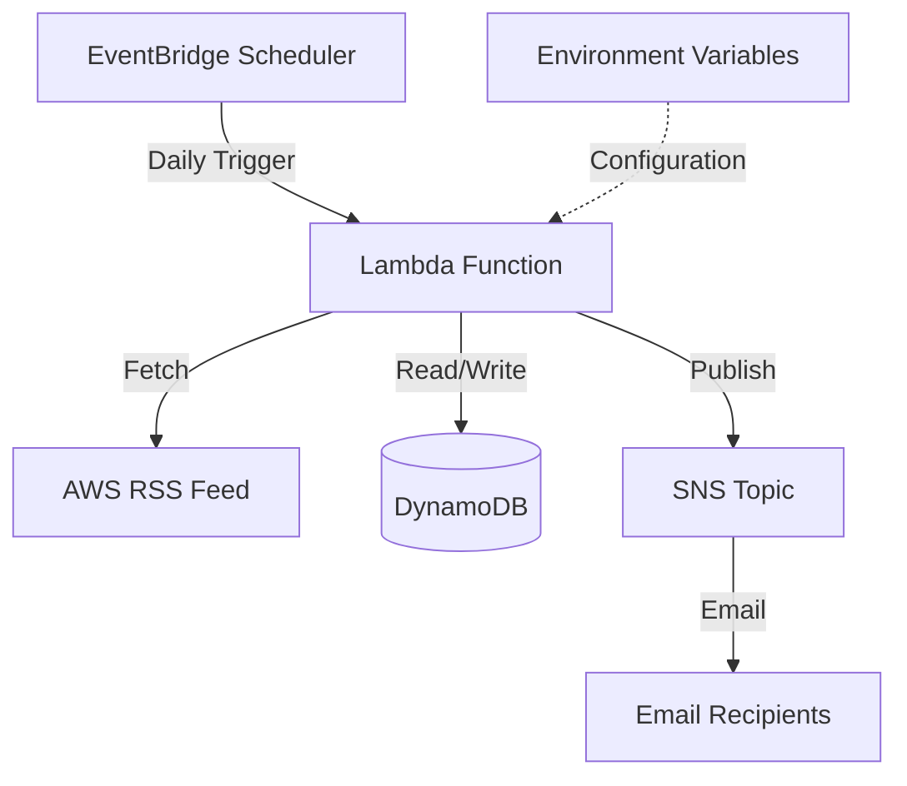
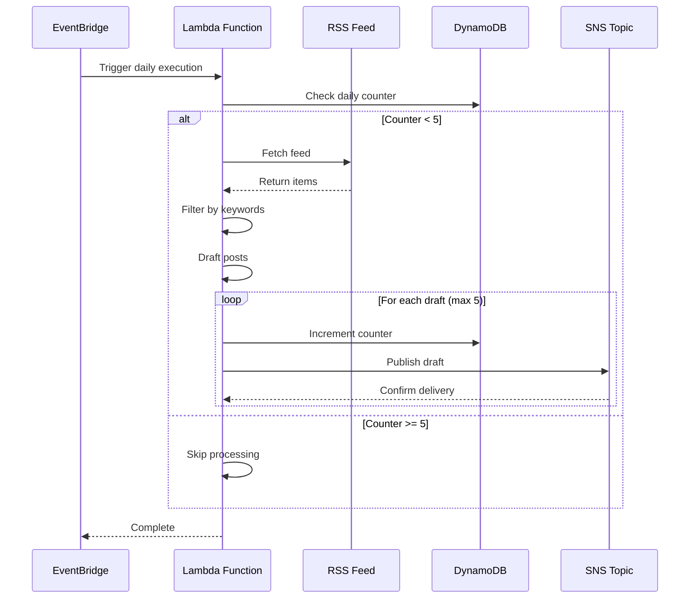

# Design Document: AWS LinkedIn Post Drafter

## Overview

The AWS LinkedIn Post Drafter is a serverless application that automatically fetches AWS news from an RSS feed, filters content based on configurable keywords, drafts LinkedIn posts, and sends them via email through AWS SNS. The system runs on a daily schedule and enforces a limit of 5 posts per day.

The architecture leverages AWS Lambda for compute, Amazon EventBridge Scheduler for scheduling, Amazon DynamoDB for state management, and Amazon SNS for email delivery. This serverless approach ensures cost-effectiveness, scalability, and minimal operational overhead.

## Architecture

### High-Level Architecture



### Component Interaction Flow



## Components and Interfaces

### 1. RSS Feed Fetcher

**Responsibility:** Retrieve and parse the AWS "What's new" RSS feed.

**Interface:**
```python
def fetch_rss_feed(feed_url: str) -> List[FeedItem]:
    """
    Fetches and parses the RSS feed from the given URL.
    
    Args:
        feed_url: The URL of the RSS feed
        
    Returns:
        List of FeedItem objects containing title, description, link, and pub_date
        
    Raises:
        FeedFetchError: If the feed cannot be retrieved or parsed
    """
```

**Implementation Notes:**
- Uses the `feedparser` library for RSS parsing
- Implements retry logic with exponential backoff (3 attempts)
- Validates feed structure before returning
- Logs all fetch attempts and errors

### 2. Content Filter

**Responsibility:** Filter RSS feed items based on configured keywords.

**Interface:**
```python
def filter_by_keywords(items: List[FeedItem], keywords: List[str]) -> List[FeedItem]:
    """
    Filters feed items that match any of the provided keywords.
    
    Args:
        items: List of feed items to filter
        keywords: List of keywords to match (case-insensitive)
        
    Returns:
        List of feed items that contain at least one keyword in title or description
    """
```

**Implementation Notes:**
- Performs case-insensitive keyword matching
- Searches both title and description fields
- Returns items in original order (most recent first)
- Logs the number of items filtered

### 3. Post Drafter

**Responsibility:** Transform filtered news items into LinkedIn post drafts.

**Interface:**
```python
def draft_linkedin_post(item: FeedItem) -> PostDraft:
    """
    Creates a LinkedIn post draft from a feed item.
    
    Args:
        item: The feed item to transform
        
    Returns:
        PostDraft object containing formatted content, hashtags, and metadata
    """
```

**Implementation Notes:**
- Formats content to be LinkedIn-friendly (max 3000 characters)
- Extracts relevant hashtags from content (e.g., #AWS, service names)
- Includes the original AWS news link
- Adds a call-to-action or engaging opening
- Ensures uniqueness by checking against previously sent drafts

### 4. Daily Counter Manager

**Responsibility:** Track and enforce the daily limit of 5 posts.

**Interface:**
```python
def get_daily_count(date: str) -> int:
    """
    Retrieves the current count of posts sent for the given date.
    
    Args:
        date: Date string in YYYY-MM-DD format
        
    Returns:
        Number of posts sent on that date
    """

def increment_daily_count(date: str) -> int:
    """
    Atomically increments the daily counter and returns the new count.
    
    Args:
        date: Date string in YYYY-MM-DD format
        
    Returns:
        New count after increment
        
    Raises:
        DailyLimitExceeded: If incrementing would exceed the limit
    """

def can_send_more_posts(date: str) -> bool:
    """
    Checks if more posts can be sent today.
    
    Args:
        date: Date string in YYYY-MM-DD format
        
    Returns:
        True if count < 5, False otherwise
    """
```

**Implementation Notes:**
- Uses DynamoDB with atomic counter operations
- Table schema: `{date: string (PK), count: number, ttl: number}`
- TTL set to 7 days for automatic cleanup
- Uses conditional updates to prevent race conditions

### 5. Email Sender

**Responsibility:** Publish post drafts to SNS topic for email delivery.

**Interface:**
```python
def send_via_sns(draft: PostDraft, topic_arn: str) -> bool:
    """
    Publishes a post draft to the configured SNS topic.
    
    Args:
        draft: The post draft to send
        topic_arn: ARN of the SNS topic
        
    Returns:
        True if successful, False otherwise
        
    Raises:
        SNSPublishError: If all retry attempts fail
    """
```

**Implementation Notes:**
- Formats the draft as a structured email message
- Includes subject line: "LinkedIn Post Draft: [News Title]"
- Implements retry logic with exponential backoff (3 attempts)
- Logs all publish attempts and results

### 6. Main Orchestrator

**Responsibility:** Coordinate all components and handle the main execution flow.

**Interface:**
```python
def lambda_handler(event: dict, context: LambdaContext) -> dict:
    """
    Main Lambda handler function triggered by EventBridge.
    
    Args:
        event: EventBridge event payload
        context: Lambda execution context
        
    Returns:
        Response dict with status and summary
    """
```

**Execution Flow:**
1. Load configuration from environment variables
2. Check if daily limit has been reached
3. Fetch RSS feed
4. Filter items by keywords
5. For each filtered item (up to remaining daily limit):
   - Draft LinkedIn post
   - Increment daily counter
   - Send via SNS
   - Handle errors and continue
6. Return summary of execution

## Data Models

### FeedItem

```python
@dataclass
class FeedItem:
    title: str
    description: str
    link: str
    pub_date: datetime
    guid: str  # Unique identifier from RSS feed
```

### PostDraft

```python
@dataclass
class PostDraft:
    content: str  # Formatted LinkedIn post content
    hashtags: List[str]
    source_link: str
    source_title: str
    created_at: datetime
    guid: str  # Reference to original feed item
```

### DynamoDB Schema

**Table Name:** `linkedin-post-drafter-counters`

**Primary Key:** `date` (String, format: YYYY-MM-DD)

**Attributes:**
- `date`: Partition key, date string
- `count`: Number, current count of posts sent
- `ttl`: Number, Unix timestamp for automatic deletion (7 days)

**Example Item:**
```json
{
  "date": "2026-01-15",
  "count": 3,
  "ttl": 1737417600
}
```

### Configuration Model

```python
@dataclass
class AppConfig:
    rss_feed_url: str
    keywords: List[str]
    sns_topic_arn: str
    daily_limit: int
    dynamodb_table_name: str
```

Configuration is loaded from environment variables:
- `RSS_FEED_URL`: URL of the AWS RSS feed
- `KEYWORDS`: Comma-separated list of keywords
- `SNS_TOPIC_ARN`: ARN of the SNS topic
- `DAILY_LIMIT`: Maximum posts per day (default: 5)
- `DYNAMODB_TABLE_NAME`: Name of the DynamoDB table


## Correctness Properties

A property is a characteristic or behavior that should hold true across all valid executions of a system—essentially, a formal statement about what the system should do. Properties serve as the bridge between human-readable specifications and machine-verifiable correctness guarantees.

### Property 1: RSS Feed Parsing Completeness

*For any* valid RSS feed item, parsing should extract all required fields (title, description, link, publication date) and produce a valid FeedItem object.

**Validates: Requirements 1.3**

### Property 2: RSS Feed Error Recovery

*For any* RSS feed fetch failure (network error, timeout, invalid response), the system should log the error and retry with exponential backoff up to 3 times.

**Validates: Requirements 1.2**

### Property 3: Malformed Item Graceful Handling

*For any* RSS feed containing both valid and invalid items, the parser should successfully extract all valid items and log errors for invalid ones without failing completely.

**Validates: Requirements 1.4**

### Property 4: Keyword Filtering Correctness

*For any* list of feed items and any keyword list, the filter should return exactly those items where the title or description contains at least one keyword (case-insensitive), and exclude all items that don't match any keyword.

**Validates: Requirements 2.2, 2.3, 2.4**

### Property 5: Post Draft Content Completeness

*For any* feed item, the generated post draft should contain the original title, a summary from the description, and the source link.

**Validates: Requirements 3.1**

### Property 6: LinkedIn Character Limit Compliance

*For any* feed item (regardless of description length), the generated post draft should not exceed LinkedIn's character limit of 3000 characters.

**Validates: Requirements 3.2**

### Property 7: Hashtag Extraction

*For any* feed item, the generated post draft should include at least one relevant hashtag extracted from the content.

**Validates: Requirements 3.3**

### Property 8: Draft Deduplication

*For any* feed item that has already been processed, attempting to draft it again should be detected and prevented based on the item's GUID.

**Validates: Requirements 3.4**

### Property 9: Daily Counter Accuracy

*For any* sequence of post sends within a single day, the daily counter should accurately reflect the number of posts sent (counter value equals number of sends).

**Validates: Requirements 4.1**

### Property 10: Item Prioritization by Recency

*For any* list of feed items, when the system approaches the daily limit, it should process items in order of most recent publication date first.

**Validates: Requirements 4.4**

### Property 11: SNS Message Structure Completeness

*For any* post draft, the SNS message should include the complete draft content, original news link, publication date, and all metadata in a structured format.

**Validates: Requirements 5.1, 5.2, 5.3**

### Property 12: SNS Publish Retry Behavior

*For any* SNS publish failure, the system should retry up to 3 times with exponential backoff before giving up.

**Validates: Requirements 5.4**

### Property 13: Configuration Parsing

*For any* comma-separated keyword string, the configuration parser should correctly split it into individual keywords and trim whitespace.

**Validates: Requirements 7.2**

### Property 14: Configuration Validation

*For any* configuration with missing or invalid required fields (RSS URL, SNS ARN, keywords), the system should fail fast with a clear error message indicating which field is invalid.

**Validates: Requirements 7.6**

### Property 15: Error Logging with Context

*For any* error that occurs during execution, the system should log the error with sufficient context including component name, timestamp, error type, and relevant data.

**Validates: Requirements 8.1, 8.4**

### Property 16: Log Level Appropriateness

*For any* operation, the system should use appropriate log levels: INFO for successful operations, WARNING for recoverable errors, ERROR for critical failures.

**Validates: Requirements 8.2, 8.3**

## Error Handling

### Error Categories

1. **Transient Errors** (Recoverable)
   - Network timeouts when fetching RSS feed
   - SNS publish throttling
   - DynamoDB conditional check failures
   - **Strategy:** Retry with exponential backoff (3 attempts)

2. **Permanent Errors** (Non-recoverable)
   - Invalid RSS feed URL
   - Missing configuration
   - SNS topic does not exist
   - DynamoDB table does not exist
   - **Strategy:** Fail fast, log error, notify administrators

3. **Partial Failures** (Continue Processing)
   - Individual RSS item parsing failures
   - Individual post draft failures
   - **Strategy:** Log error, skip item, continue with remaining items

### Error Handling Patterns

**Retry with Exponential Backoff:**
```python
def retry_with_backoff(func, max_attempts=3, base_delay=1):
    for attempt in range(max_attempts):
        try:
            return func()
        except TransientError as e:
            if attempt == max_attempts - 1:
                raise
            delay = base_delay * (2 ** attempt)
            time.sleep(delay)
            logger.warning(f"Retry {attempt + 1}/{max_attempts} after {delay}s")
```

**Graceful Degradation:**
- If some feed items fail to parse, process the valid ones
- If some drafts fail to send, continue with remaining drafts
- Always return a summary of successes and failures

**Circuit Breaker:**
- If RSS feed fails consistently, stop attempting for the current execution
- If SNS publish fails for all drafts, stop processing and alert

## Testing Strategy

### Unit Testing

Unit tests will verify specific examples, edge cases, and error conditions for individual components:

- **RSS Feed Fetcher:**
  - Test successful fetch with mock RSS feed
  - Test retry behavior with simulated network failures
  - Test parsing of various RSS feed formats
  - Test handling of malformed XML

- **Content Filter:**
  - Test filtering with various keyword combinations
  - Test case-insensitive matching
  - Test empty keyword list behavior
  - Test empty feed list behavior

- **Post Drafter:**
  - Test draft generation with typical feed items
  - Test character limit enforcement with long descriptions
  - Test hashtag extraction from various content types
  - Test deduplication logic

- **Daily Counter Manager:**
  - Test counter initialization
  - Test atomic increment operations
  - Test limit enforcement at boundary (5th post)
  - Test behavior on new day

- **Email Sender:**
  - Test SNS message formatting
  - Test retry logic with mock SNS failures
  - Test error handling for invalid topic ARN

- **Configuration:**
  - Test loading from environment variables
  - Test validation of required fields
  - Test parsing of comma-separated keywords

### Property-Based Testing

Property-based tests will verify universal properties across many generated inputs using a PBT library (Hypothesis for Python). Each test will run a minimum of 100 iterations.

**Test Configuration:**
- Library: Hypothesis (Python)
- Minimum iterations: 100 per property
- Each test tagged with: `Feature: aws-linkedin-post-drafter, Property N: [property text]`

**Property Test Coverage:**

1. **Property 1 (RSS Parsing):** Generate various valid RSS feed structures and verify all fields are extracted
2. **Property 2 (Error Recovery):** Generate various failure scenarios and verify retry behavior
3. **Property 3 (Graceful Handling):** Generate feeds with mixed valid/invalid items and verify partial success
4. **Property 4 (Filtering):** Generate random feed items and keyword lists, verify filtering correctness
5. **Property 5 (Content Completeness):** Generate random feed items and verify draft contains all required elements
6. **Property 6 (Character Limits):** Generate feed items with varying description lengths and verify limit compliance
7. **Property 7 (Hashtags):** Generate feed items and verify hashtag extraction
8. **Property 8 (Deduplication):** Generate duplicate items and verify only one draft is created
9. **Property 9 (Counter Accuracy):** Generate sequences of sends and verify counter matches
10. **Property 10 (Prioritization):** Generate items with random dates and verify ordering
11. **Property 11 (SNS Structure):** Generate drafts and verify SNS message structure
12. **Property 12 (Retry Behavior):** Generate failure scenarios and verify retry attempts
13. **Property 13 (Config Parsing):** Generate various keyword string formats and verify parsing
14. **Property 14 (Config Validation):** Generate invalid configurations and verify error messages
15. **Property 15 (Error Logging):** Generate errors and verify log entries contain required context
16. **Property 16 (Log Levels):** Generate various operations and verify appropriate log levels

### Integration Testing

Integration tests will verify end-to-end flows with real AWS services (using LocalStack or AWS test accounts):

- Test complete Lambda execution flow
- Test DynamoDB counter operations with real table
- Test SNS publishing with test topic
- Test EventBridge trigger integration

### Testing Balance

- **Unit tests** focus on specific examples and edge cases for each component
- **Property tests** verify universal correctness across many inputs
- Both approaches are complementary and necessary for comprehensive coverage
- Property tests catch unexpected edge cases that unit tests might miss
- Unit tests provide clear examples of expected behavior

## Deployment Considerations

### Infrastructure as Code

The application will be deployed using AWS CDK (Cloud Development Kit) with the following resources:

- **Lambda Function:** Python 3.11 runtime, 512MB memory, 5-minute timeout
- **EventBridge Scheduler:** Daily trigger at configured time (e.g., 9 AM UTC)
- **DynamoDB Table:** On-demand billing, TTL enabled
- **SNS Topic:** Standard topic with email subscriptions
- **IAM Roles:** Least-privilege permissions for Lambda execution

### Environment Variables

- `RSS_FEED_URL`: https://aws.amazon.com/about-aws/whats-new/recent/feed/
- `KEYWORDS`: Comma-separated list (e.g., "Lambda,S3,DynamoDB,AI,Machine Learning")
- `SNS_TOPIC_ARN`: ARN of the SNS topic for email delivery
- `DAILY_LIMIT`: Maximum posts per day (default: 5)
- `DYNAMODB_TABLE_NAME`: Name of the counter table
- `LOG_LEVEL`: Logging verbosity (default: INFO)

### Monitoring and Observability

- **CloudWatch Logs:** All Lambda execution logs
- **CloudWatch Metrics:** Custom metrics for posts sent, errors, execution duration
- **CloudWatch Alarms:** Alert on execution failures, SNS publish failures
- **X-Ray Tracing:** Distributed tracing for debugging

### Cost Optimization

- Lambda: Pay per invocation (1 execution/day)
- DynamoDB: On-demand pricing with TTL for automatic cleanup
- SNS: Pay per message (max 5/day)
- EventBridge: Minimal cost for single daily schedule
- **Estimated monthly cost:** < $1 USD for typical usage
